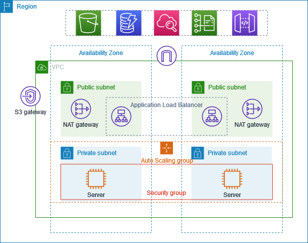

# Architectural Flow

There is a `VPC`, `Public Subnet` & `Private Subnet` in 2 `Availability Zones`. We will deploy 2 private `EC2` instances 1 in each AZ. Next we have 1 Public EC2 or the `Bastion/Jump Server`.
